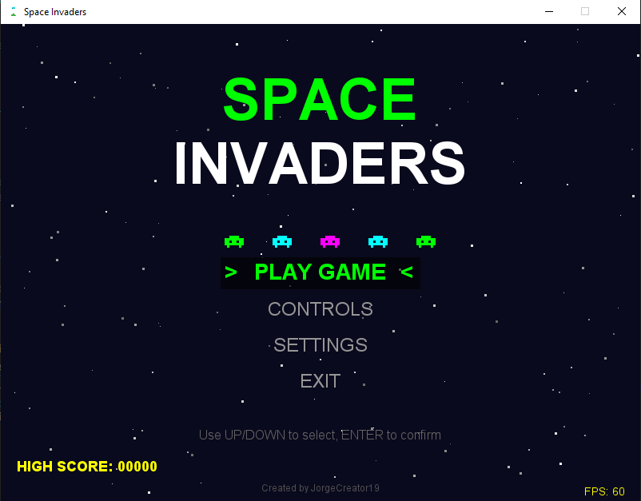
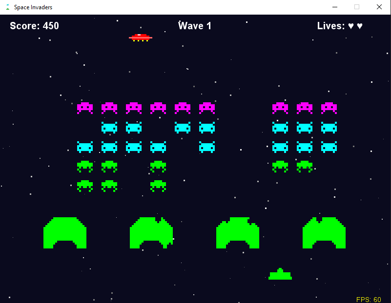
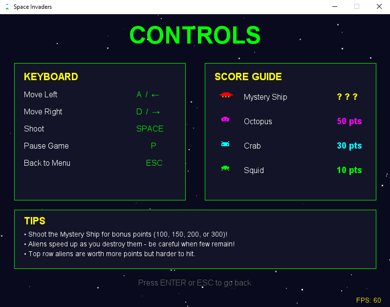
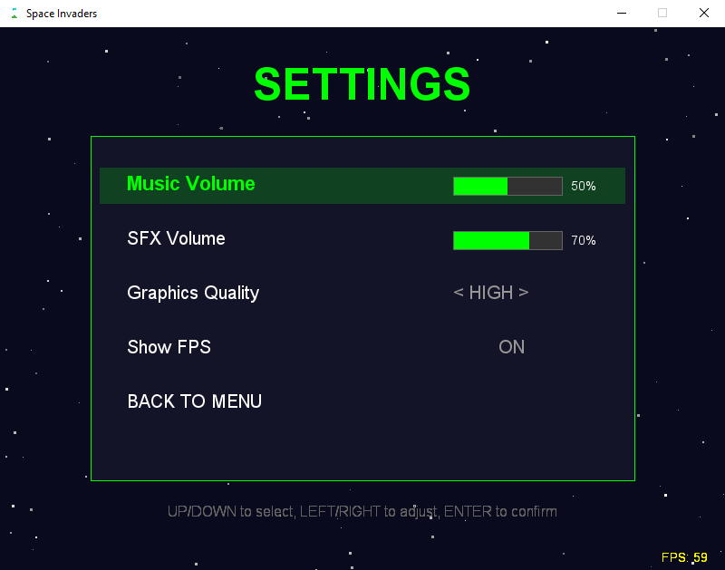
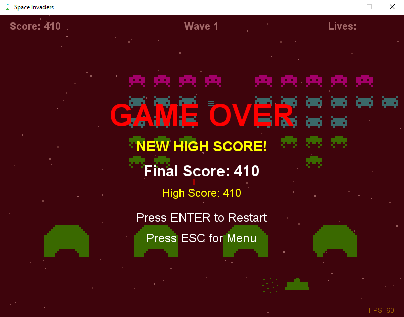

# 👾 Space Invaders

A classic Space Invaders game built with **Java** and **Java2D**.


---

## 📸 Screenshots

### Main Menu


### Gameplay


### Controls


### Settings


### Game Over


---

## ✨ Features

- 🎮 Classic Space Invaders gameplay
- 👾 3 types of pixel art aliens (Octopus, Crab, Squid)
- 🛸 Mystery Ship with bonus points (100-300)
- 🛡️ 4 destructible shields/bunkers
- 💥 Explosion animations
- 🌟 Animated starfield background
- 🎵 Sound effects and background music
- 🎚️ Volume controls (Music & SFX)
- ⚙️ Graphics quality settings (High/Medium/Low)
- 📊 FPS counter (toggleable)
- 🏆 High score saving (persists between sessions)
- ⏸️ Pause functionality
- 🌊 Wave progression with increasing difficulty

---

## 🎮 Controls

| Key | Action |
|-----|--------|
| `A` / `←` | Move Left |
| `D` / `→` | Move Right |
| `SPACE` | Shoot |
| `P` | Pause / Resume |
| `ESC` | Back to Menu |
| `↑` / `↓` | Menu Navigation |
| `ENTER` | Select / Confirm |

---

## 🎯 Score Guide

| Alien | Type | Points |
|-------|------|--------|
| 👾 (Purple) | Octopus | 50 pts |
| 👾 (Cyan) | Crab | 30 pts |
| 👾 (Green) | Squid | 10 pts |
| 🛸 (Red) | Mystery Ship | 100-300 pts |

---

## 🖥️ Java Version (Desktop)

### Requirements

- Java 17 or higher

### Project Structure

```
Space-Invaders/
├── src/
│   └── com/spaceinvaders/
│       ├── Main.java                 # Entry point
│       ├── utils/
│       │   ├── Constants.java        # Game settings
│       │   ├── SoundManager.java     # Audio handling
│       │   ├── Settings.java         # Graphics/sound settings
│       │   └── ScoreManager.java     # High score persistence
│       ├── entities/
│       │   ├── GameObject.java       # Base entity class
│       │   ├── Player.java           # Player spaceship
│       │   ├── Alien.java            # Alien enemy
│       │   ├── AlienFormation.java   # Alien grid manager
│       │   ├── Bullet.java           # Projectiles
│       │   ├── MysteryShip.java      # Bonus UFO
│       │   ├── Shield.java           # Destructible bunkers
│       │   ├── Explosion.java        # Explosion animation
│       │   └── Star.java             # Background star
│       └── game/
│           ├── GameState.java        # Game states enum
│           ├── GamePanel.java        # Rendering & game loop
│           ├── GameFrame.java        # Window container
│           └── InputHandler.java     # Keyboard input
├── resources/
│   ├── images/
│   │   └── icon.png                  # Window icon
│   └── sounds/
│       ├── shoot.wav                 # Shooting sound
│       ├── explosion.wav             # Alien explosion
│       ├── player_explosion.wav      # Player hit
│       ├── menu_select.wav           # Menu navigation
│       ├── menu_confirm.wav          # Menu selection
│       ├── pause.wav                 # Pause sound
│       ├── gameover.wav              # Game over
│       ├── victory.wav               # Wave complete
│       └── background_music.wav      # Background music
├── screenshots/
│   ├── menu.png
│   ├── gameplay.png
│   ├── controls.png
│   ├── settings.png
│   └── gameover.png
├── bin/                              # Compiled classes
├── highscore.dat                     # Saved high score
└── README.md
```

### How to Run

#### Compile

```bash
cd Space-Invaders
javac -d bin src/com/spaceinvaders/*.java src/com/spaceinvaders/utils/*.java src/com/spaceinvaders/entities/*.java src/com/spaceinvaders/game/*.java
```

#### Run

```bash
java -cp bin com.spaceinvaders.Main
```

---

## 🛠️ Technologies Used

- **Java 17** - Programming language
- **Java Swing** - GUI framework
- **Java2D** - Graphics rendering
- **Java Sound API** - Audio playback
- **BufferedImage** - Sprite caching for performance

---

## 🎯 Game Rules

1. Control the spaceship using A/D or arrow keys
2. Shoot aliens with SPACE to earn points
3. Top row aliens (purple) are worth more points
4. Destroy the Mystery Ship for bonus points (100-300)
5. Use shields for protection - but they can be destroyed!
6. Don't let aliens reach the bottom or you lose
7. Don't get hit by alien bullets
8. Clear all aliens to advance to the next wave
9. Aliens speed up as you destroy more of them
10. Aliens shoot more frequently in higher waves

---

## 🛡️ Shields

- 4 destructible shields protect the player
- Both player and alien bullets damage shields
- Aliens will destroy shields if they touch them
- Shields reset each wave

---

## ⚙️ Settings

| Setting | Options | Description |
|---------|---------|-------------|
| Music Volume | 0-100% | Background music volume |
| SFX Volume | 0-100% | Sound effects volume |
| Graphics Quality | High/Medium/Low | Adjusts star count for performance |
| Show FPS | ON/OFF | Display FPS counter |

---

## 🚀 Future Improvements

- [ ] Different difficulty modes
- [ ] More alien types
- [ ] Power-ups (rapid fire, shield, extra life)
- [ ] Boss battles
- [ ] Online leaderboard
- [ ] Mobile version
- [ ] Two-player mode

---

## 📁 Full Project Structure

```
Space-Invaders/
├── README.md
├── .vscode/
│   └── settings.json
├── src/
│   └── com/
│       └── spaceinvaders/
│           ├── Main.java
│           ├── utils/
│           │   ├── Constants.java
│           │   ├── SoundManager.java
│           │   ├── Settings.java
│           │   └── ScoreManager.java
│           ├── entities/
│           │   ├── GameObject.java
│           │   ├── Player.java
│           │   ├── Alien.java
│           │   ├── AlienFormation.java
│           │   ├── Bullet.java
│           │   ├── MysteryShip.java
│           │   ├── Shield.java
│           │   ├── Explosion.java
│           │   └── Star.java
│           └── game/
│               ├── GameState.java
│               ├── GamePanel.java
│               ├── GameFrame.java
│               └── InputHandler.java
├── resources/
│   ├── images/
│   └── sounds/
├── bin/
├── screenshots/
└── highscore.dat
```

---

## 👤 Author

**JorgeCreator19**

- GitHub: [@JorgeCreator19](https://github.com/JorgeCreator19)

---

## 📄 License

This project is open source and available under the [MIT License](LICENSE).

---

## 🙏 Acknowledgments

- Original Space Invaders (1978) by Tomohiro Nishikado for inspiration
- Free sound effects from [Freesound](https://freesound.org/)
- Classic arcade games for the retro aesthetic